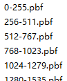

WebGL 显示中文字体(1) -- fontnik工具
==================================

[Mapbox GL](https://github.com/mapbox/mapbox-gl-js)提供了通过读取和渲染`protobuf`格式的字体文件，显示象形文字字体（glyph）的接口。但是，字体文件却需要自行创建。

本文介绍使用[fontnik](https://github.com/mapbox/node-fontnik)工具将`.ttf`、`.ttc`等格式的字体转换成加载所需要的`.pbf`文件的方法。

<!-- TOC -->

- [字体分段加载](#字体分段加载)
- [fontnik](#fontnik)
    - [安装](#安装)
    - [转换代码](#转换代码)
    - [调用](#调用)
- [字体渲染效果](#字体渲染效果)
- [参考](#参考)

<!-- /TOC -->

## 字体分段加载
一次性加载中文字体库会遇到文件过大，加载时间过长的问题。Mapbox GL JS借鉴了地图切片的原理，根据字符编码范围进行分段，将[0, 65535]的字符按照每段长度256的方式分为若干段，每段以start-end.pbf的格式进行命名。在加载时，根据字符的编码确定该字符所在的分段，然后请求相关的文件。

<div style="text-align: center">
    
</div>

分段后的文件如上图。

## fontnik
[fontnik](https://github.com/mapbox/node-fontnik)库中提供了分段处理的接口，需要通过代码实现转换。

### 安装

``` node
npm install
```
建议的环境：
* 64 bit OS X or 64 bit Linux
* Node.js v0.10.x, v0.12.x, v4.x or v6.x


在window 10系统，Node 8.9.2版本下安装过几次，没有成功。

### 转换代码
    var fontnik = require('.');
    var fs = require('fs');
    var path = require('path');

    /**
    * 转换方法
    * @param {String} fileName 字体文件路径
    * @param {String} outputDir 输出分段文件路径
    */
    var convert = function (fileName, outputDir) {
        var font = fs.readFileSync(path.resolve(__dirname + "/" + fileName));
        output2pbf(font, 0, 255, outputDir);
    }

    function output2pbf(font, start, end, outputDir) {
        if (start > 65535) {
            console.log("done!");
            return;
        }
        fontnik.range({ font: font, start: start, end: end }, function (err, res) {
            var outputFilePath = path.resolve(__dirname + "/" + outputDir + start + "-" + end + ".pbf");
            fs.writeFile(outputFilePath, res, function (err) {
                if (err) {
                    console.error(err);
                } else {
                    output2pbf(font, end + 1, end + 1 + 255, outputDir);
                }
            });
        });
    }
    convert("./fonts/YaHei/MSYaHei.ttf", "./Microsoft YaHei/");

### 调用
1. 创建`convert.js`文件，内容为上面的代码
2. 将`convert.js`文件放到node-fontnik文件夹中
3. `node convert.js`, done!

## 字体渲染效果

* 楷体转换效果：

    <div style="text-align: center">
        
    </div>

* 黑体转换效果：

    <div style="text-align: center">
        
    </div>


## 参考
[mapbox/node-fontnik工具使用介绍](https://www.jianshu.com/p/23634e54487e)